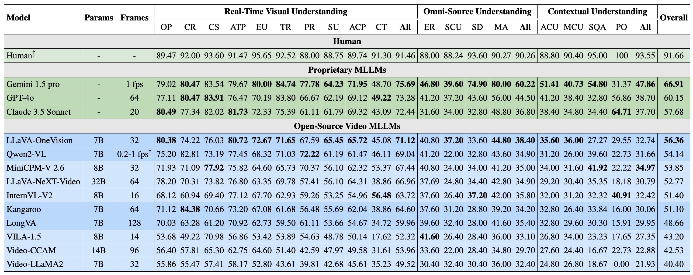
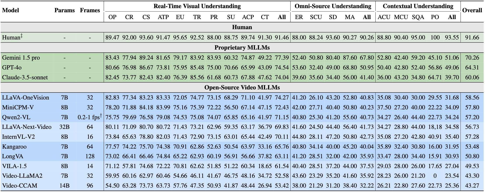
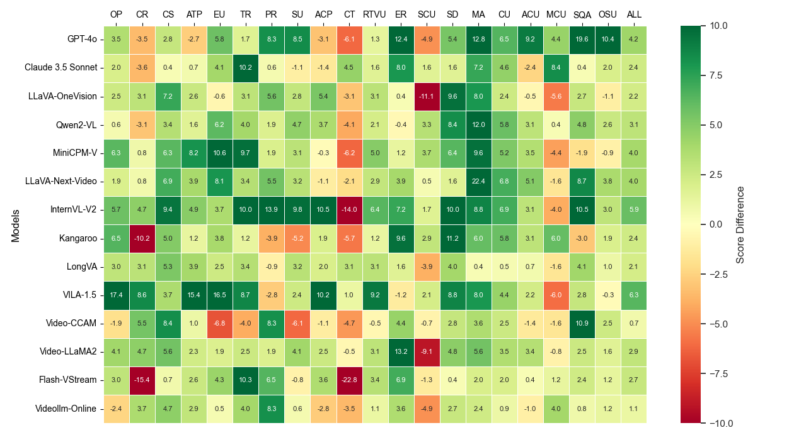
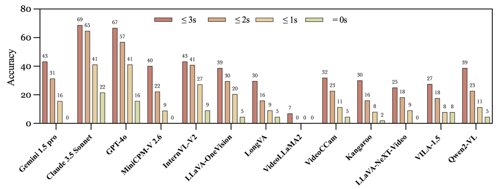

# StreamingBench: Assessing the Gap for MLLMs to Achieve Streaming Video Understanding

<div align="center">
  

  <div style="margin: 30px 0">
    <a href="https://streamingbench.github.io/" style="margin: 0 10px">🏠 Project Page</a> |
    <a href="https://arxiv.org/pdf/ICLR_2025" style="margin: 0 10px">📄 arXiv Paper</a> |
    <a href="https://huggingface.co/datasets/mjuicem/StreamingBench" style="margin: 0 10px">📦 Dataset</a> |
    <a href="https://streamingbench.github.io/#leaderboard" style="margin: 0 10px">🏅Leaderboard</a>
  </div>
</div>

**StreamingBench** evaluates **Multimodal Large Language Models (MLLMs)** in real-time, streaming video understanding tasks. 🌟

## 👀 StreamingBench Overview

As MLLMs continue to advance, they remain largely focused on offline video comprehension, where all frames are pre-loaded before making queries. However, this is far from the human ability to process and respond to video streams in real-time, capturing the dynamic nature of multimedia content. To bridge this gap, **StreamingBench** introduces the first comprehensive benchmark for streaming video understanding in MLLMs.

### Key Evaluation Aspects
- 🎯 **Real-time Visual Understanding**: Can the model process and respond to visual changes in real-time?
- 🔊 **Omni-source Understanding**: Does the model integrate visual and audio inputs synchronously as seen in live environments?
- 🎬 **Contextual Understanding**: Can the model maintain continuity in its responses based on historical interactions within the video?

### Dataset Statistics
- 📊 **900** diverse videos
- 📝 **4,500** human-annotated QA pairs
- ⏱️ Five questions per video at different timestamps
#### 🎬 Video Categories
<div align="center">
  
</div>

#### 🔍 Task Taxonomy
<div align="center">
  
</div>

## 📐 Dataset Examples
https://github.com/user-attachments/assets/3231a191-0da4-4b40-8cd6-eb7c77549cf7

<div align="center">
  <video width="100%" controls>
    <source src="./figs/example.video" type="video/mp4">
    Your browser does not support the video tag.
  </video>
</div>

## 🔮 Evaluation Pipeline

### Requirements

- Python 3.x
- moviepy

### Data Preparation

1. **Download Dataset**: Retrieve all necessary files from the [StreamingBench Dataset](https://huggingface.co/datasets/mjuicem/StreamingBench).
   
2. **Decompress Files**: Extract the downloaded files and organize them in the `./data` directory as follows:

   ```
   StreamingBench/
   ├── data/
   │   ├── real/               # Unzip Real Time Visual Understanding_*.zip into this folder
   │   ├── omini/              # Unzip other .zip files into this folder
   │   ├── sqa/                # Unzip Sequential Question Answering_*.zip into this folder
   │   └── proactive/          # Unzip Proactive Output_*.zip into this folder
   ```

3. **Preprocess Data**: Run the following command to preprocess the data:

   ```bash
   bash scripts/preprocess.sh
   ```

### Model Preparation

Prepare your own model for evaluation by following the instructions provided [here](./docs/model_guide.md). This guide will help you set up and configure your model to ensure it is ready for testing against the dataset.
## 🔬 Experimental Results

### Performance of Various MLLMs on StreamingBench
- All Context
<div align="center">
  
</div>

- 60 seconds of context preceding the query time
<div align="center">
  
</div>

- Comparison of Main Experiment vs. 60 Seconds of Video Context
- <div align="center">
  
</div>

### Performance of Different MLLMs on the Proactive Output Task
*"≤ xs" means that the answer is considered correct if the actual output time is within x seconds of the ground truth.*
<div align="center">
  
</div>


## 📝 Citation
